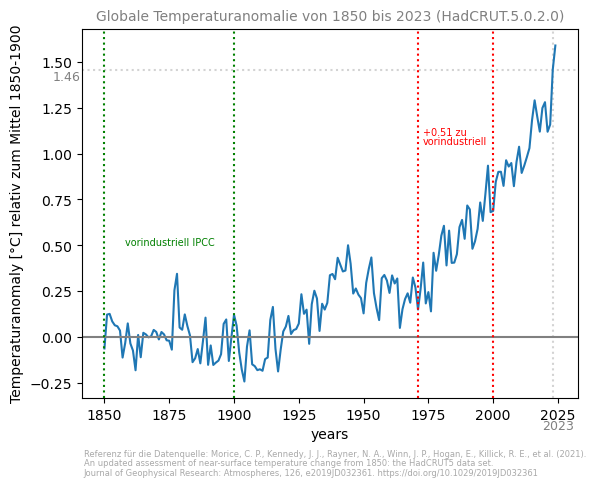
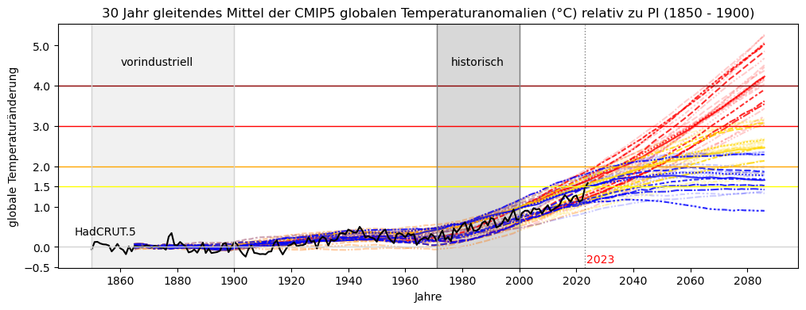

Globale Erwärmungsstufen
------------------------

Die Zeiträume, in denen die globalen Erwärmungsstufen (engl.: global warming level (GWL)) von +1.5, +2, +3 und +4 °C erreicht werden, beziehen sich auf den vorindustriellen Durchschnittswert der Jahre 1850 bis 1900. Sie werden für CMIP5 Projektionen unter Verwendung eines gleitenden 30-Jährigen Mittelwertes berechnet.

Für die Berechnung der GWL wird die Methode aus dem `IPCC Atlas`_ verwendet (`Mathias Hauser`_). Für diese Untersuchungen wurde lediglich die 20-Jährige Zeitspanne im Programm scripts/getGWL.R auf eine 30-Jährige Zeitspanne erweitert. Der `Unterschied`_ ist gering, in Einzelfällen verschiebt sich das zentrale Jahr des gemittelten Zeitraumes um ein Jahr.

Vorindustriell und heute
........................

Die GWL werden im Vergleich zur vorindustriellen Periode (PI) der Jahre 1851 bis 1900 berechnet. Um zu untersuchen, wie stark sich die Temperatur global in den Jahren 1971 bis 2000 verändert hat, verwenden wir den HadCRUT5_ Datensatz (_`Morice`), welcher üblicherweise in GWL-Studien verwendet wird. Global ist im HadCRUT Datensatz bereits ein mittlerer Temperaturanstieg von 0,51 °K im Vergleich zum vorindustriellen Zeitraum der Jahre 1971 bis 2000 zu erkennen.

**Abbildung 3** zeigt die jährliche Anomalie der global gemittelten Temperatur im Vergleich zum vorindustriellen Zeitraum von 1851 1900. Die mittlere Änderung im historischen Zeitraum von 1971 bis 2000 beträgt 0.51 K und ist eingezeichnet.

.. code-block:: console

   $ Notebooks/HadCru_GWL-update2024.ipynb

Es ist nicht möglich mit Hilfe der regionalen Klimasimulationen aus dem EURO-CORDEX Ensemble die Änderung zwischen dem vorindustriellen Zeitraum zu den Zeiträumen der Globalen Erwärmungsstufen zu berechnen, da das EURO-CORDEX Ensemble erst im Jahr 1971 beginnt. Als historischer Zeitraum wird daher 1971-2000 festgelegt. In diesen Untersuchungen können wir nur zeigen, wie sich das Klima während des Zeitraums einer Erwärmungstufe im Vergleich zum historischen Zeitraum verändert hat. Die Temperatur ist bereits im historischen Zeitraum angestiegen.

Ensembles für verschiedene Erwärmungsniveaus
............................................
Die Anzahl der globalen Projektionen in den Ensembles für jedes GWL ändert sich. Zum Beispiel ist es in der Abbildung 4 offensichtlich, dass die Projektionen unter Verwendung von RCP2.6 keine globale Erwärmung von 3 °C erreichen.

**Abbildung 4** zeigt alle CMIP5 Projektionen, die im IPCC Atlas verwendet werden. Die helleren Linien repräsentieren die globalen Klimamodelle, die nicht als Antrieb in EURO-CORDEX verwendet werden, die dunkleren Linien repräsentieren die GCMs, die als Antrieb in EURO-CORDEX verwendet werden. Die als Antrieb verwendeten GCMs decken nahezu die gesamte Bandbreite der Temperaturveränderung auf globaler Ebene ab.

.. code-block:: console

   $ Notebooks/read_atlas_cmip5.ipynb

Es werden die EURO-CORDEX-Projektionen unter Verwendung von RCP8.5 für jedes Erwärmungsniveau untersucht, somit bleibt das Ensemble über alle GWL einigermaßen konstant (Nicht alle Globalmodelle erreichendas GWL 4°C). Das Ensemble von EURO-CORDEX RCP8.5 enthält die meisten Kombinationen von globalen Klimamodellen (GCM) und regionalen Klimamodellen (RCM). Dennoch besteht eine Unsicherheit, da unterschiedliche Treibhausgasantriebe eine Wirkung haben können (Bärring_, 2018), insbesondere im Hinblick auf Extremereignisse. Andere Autoren empfehlen, alle Szenarien für einige Variablen zu kombinieren, aber nicht für alle Variablen, siehe Querkapitel-Box 11.1 im `IPCC AR6 WG1 Chapter 11`_ .

Im folgenden werden Zeitscheiben, der globalen Erwärmsstufen der einzelen Simulationen pro RCP für das gesammte Globalmodell Ensemble des IPCC mit dem Ensemble der Globalmodelle, welche für EURO-CORDEX als Antrieb verwendet wurden, verglichen.

.. image:: plots/years_of_GWL_scenario_ensemble.png

**Abbildung 5** zeigt das zentrale Jahr der Erwärmungsstufe eines 30-Jahres-Zeitraums für jedes Globalmodell. Es werden für jedes Szenario das Ensemble der CMIP5 Modelle (*verwendet im IPCC Atlas*) mit dem Ensemble der CMIP5 Modelle (*verwendet als Antrieb für in EURO-CORDEX*) mit einander verglichen. Die farbige Box erstreckt sich über den Bereich vom 25. bis zum 75. Perzentil, wobei der Median als schwarze Linie in der Mitte dargestellt wird. Der Median wird auch als blaue Zahl oben aufgeführt, und die schwarze Zahl unten gibt die Anzahl der Simulationen an, die das jeweilige GWL erreicht.

.. code-block:: console

   $ GWL_table/plot_GWL_years.ipynb

Der Vergleich der zentralen Jahre der Erwärmungsstufen zwischen dem CMIP5-Ensemble (CMIP5) (*verwendet im IPCC Atlas*) und dem CMIP5-Ensemble (CMIP5-CORDEX) (*verwendet als Antrieb für EURO-CORDEX*) zeigt geringe Unterschiede zwischen den Szenarien für die Globalen Erwärmungsstufen 1.5°C und 2°C. Für die Globale Erwärmungsstufe 3° ist der Unterschied bezüglich des Zeitraumes zwischen RCP45 und RCP85 größer als 10 Jahre. Für jedes Szeanrio stimmt der Median des CMIP5 Ensembles gut mit dem Median des CMIP5-CORDEX Ensembles überein. Eine Ausnahme bildet das  Globale Erwärmungsniveau 4°C, welches nur von einigen RCP85 Simulation erreicht wird und es weicht der Median der beiden ensemble um 8 Jahre von einander ab.

In der Tabelle der Klimaparameter im *Klima-Taten-Blatts* ist das 30 jährige Mittel für den historischen Zeitraum auf Grundlage von Beobachtungen (siehe vorrangehendes Kapitel) dargestellt, sowie der Median der Änderungen im EURO-CORDEX-Ensembles zum historischen Zeitraum für die verschiedenen Globalen Erwärmungsstufen nur auf Grundlage des RCP85 Szenarios um das Ensemble einigermaßen Konstant zu halten über die vier globalen Erwärumnungsstufen.

Literatur
..........
Der beste Überblick über die unterschiedlichen Methoden zur Berechnung der globalen Erwärmungsstufen sind in `Nikolin (2018)`_ um im `IPCC`_ Atlas dargelegt. Weiterführen Information enthalten `Vautard (2014)`_ und `Kjellstroem (2017)`_.

.. _Bärring: ../literature/Bärring_2018_Environ._Res._Lett._13_024029.pdf

.. _`Mathias Hauser`: https://github.com/mathause/cmip_warming_levels

.. _`Vautard (2014)`: literature/The_European_climate_under_a_2_C_global_warming.pdf

.. _`Kjellstroem (2017)`: literature/Kjellstroem_2018.pdf

.. _`Nikolin (2018)`: literature/Nikulin_2018_Environ._Res._Lett._13_065003.pdf

.. _IPCC: https://github.com/IPCC-WG1/Atlas/tree/main/warming-levels

.. _HadCRUT5: https://www.metoffice.gov.uk/hadobs/hadcrut5/data/HadCRUT.5.0.2.0/download.html

.. _`IPCC Atlas`: https://github.com/IPCC-WG1/Atlas/tree/main/warming-levels

.. _`IPCC AR6 WG1 Chapter 11`: https://www.ipcc.ch/report/ar6/wg1/chapter/chapter-11/

.. _`Morice`: https://agupubs.onlinelibrary.wiley.com/doi/full/10.1029/2019JD032361
