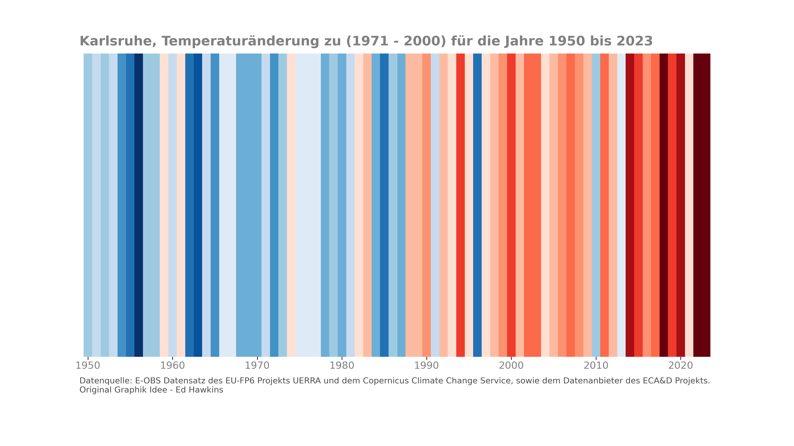

Einleitung
----------
Dieses Repositorium bietet einen Überblick über die einzelnen Verfahren der Datenaufbereitung und führt die zugrunde liegenden Daten auf, die schließlich zur Broschüre *Stadtwald Karlsruhe im Klimawandel* führen. Des Weiteren werden hier zusätzliche Analysen der Klimaparameter dargestellt, um das Verständnis zu vertiefen.

**Abbildung 1** zeigt die Erwärmungsstreifen (`climate stripes`_) der jährlichen mittleren Temperaturabweichung zum Mittel über die Jahre 1971 bis 2000 für das Gebiet des Landkreises Karlsruhe. Dabei steht dunkles Blau für kühl und dunkles Rot für warm. Die Datengrundlage sind die Beobachtungen E-OBS_ aus dem EU-FP6-Projekt UERRA , Copernicus Climate Change Service und dem ECA&D-Projekt. Diese Abbildung befindet sich auf der Titelseite der Broschüre *Stadtwald Karlsruhe im Klimawandel*.

Der Stadtwald ist ein wichtiger Teil der grünen Lunge von Karlsruhe - er bietet Menschen einen Ort der Erholung und ist Lebensraum für Tiere, Pflanzen und Pilze. Doch die Auswirkungen des Klimawandels sind auch hier bereits spürbar: insbesondere die langanhaltende Hitze sowie die Trockenheit in den vergangenen Sommern haben zu dauerhaften Schäden geführt.

Die Erwärmungsstreifen können mit dem folgenden Notebook erstellt werden:

.. code-block:: console

   $ Notebooks/EOBS/Plot_EOBS_climatestripes.ipynb

.. _`E-OBS`: https://cds.climate.copernicus.eu/cdsapp#!/dataset/insitu-gridded-observations-europe

.. _`climate stripes`: https://www.climate-lab-book.ac.uk/
